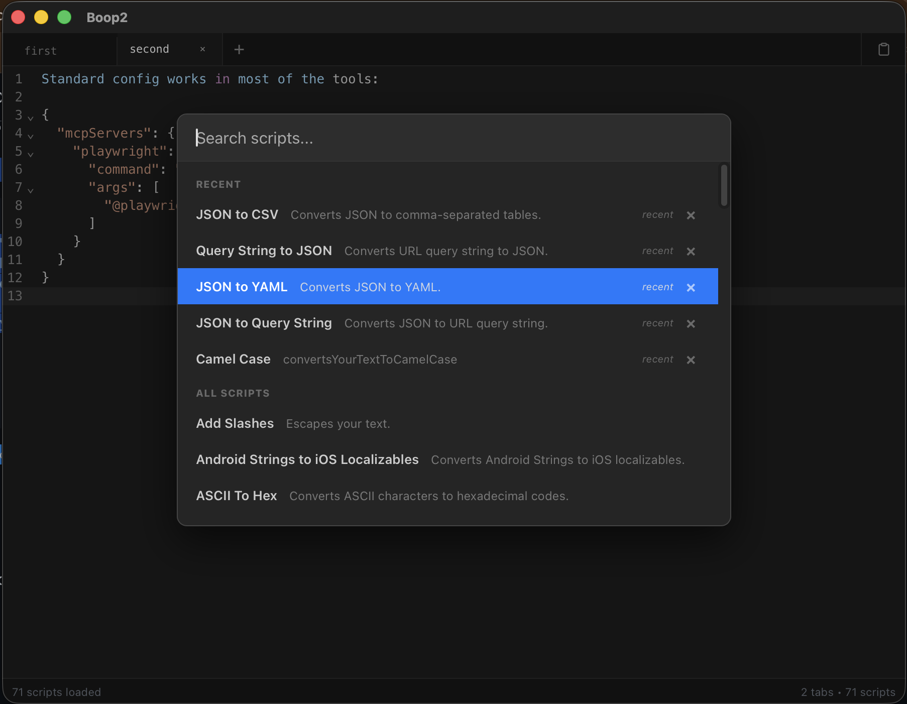

# Boop2

[](https://github.com/inchan/Boop2/actions/workflows/ci.yml)
[](https://github.com/inchan/Boop2/actions/workflows/release.yml)
[](https://opensource.org/licenses/MIT)



A scriptable developer's notepad for quick text manipulation. Ported from the original macOS app to **Tauri 2.0**, featuring multi-tab support and background script execution.

## ⚡️ Quick Start (Recommended)
Get Boop2 running in a single command. This will install dependencies, build the app, and launch it:
```bash
./scripts/BIR.sh
```

## 📦 Manual Installation
For users who just want the pre-built app:
1. **Download:** Grab the latest `.app` or `.dmg` from the **Releases**.
2. **Install:** Move to your `/Applications` folder.
3. **Run:** Open Boop2 and press `Cmd + B` to start booping!

---

## 🚀 Features
- **Multi-Tab Interface:** Work on multiple documents at once. (`Cmd + T`, `Cmd + W`, `Cmd + 1~9`)
- **Background Workers:** UI never freezes during heavy text processing.
- **Intelligent Session History:** 
    - Automatically archives your work internally (stores up to 50 sessions).
    - Shows the **latest 2 sessions** in the restore menu for quick recovery.
- **Clipboard Tracking:** Keeps a history of your last 20 pasted snippets.
- **Unicode Support:** Native support for Korean and special characters.
- **Minimalist Design:** Custom Dark Theme with SF Mono font.

## ⚙️ CI/CD & Automation
Boop2 uses **GitHub Actions** to ensure high code quality and seamless delivery:
- **Continuous Integration (CI):** Every push and pull request triggers automated ESLint, Prettier, TypeScript type checks, and Vitest runs across Linux, macOS, and Windows.
- **Automated Releases (CD):** Pushing a version tag (e.g., `v1.0.0`) automatically builds and uploads production-ready binaries for all major platforms to GitHub Releases.

## 🛠 For Developers
To start the app in debug mode with live updates:
```bash
npm install
npm run tauri dev
```

## 📖 Documentation
- **[User Guide](docs/USER_GUIDE.md)**: Features and usage instructions.
- **[Custom Scripts](docs/CustomScripts.md)**: How to write and add your own scripts.
- **[Supported Modules](docs/Modules.md)**: Built-in libraries available to scripts.
- **[Development](docs/DEVELOPMENT.md)**: Architecture and build process.
- **[Release Process](docs/RELEASE_PROCESS.md)**: Steps for publishing a new version.

## ⚖️ License
MIT License. Based on the original Boop by [Ivan Mathy](https://github.com/IvanMathy).
